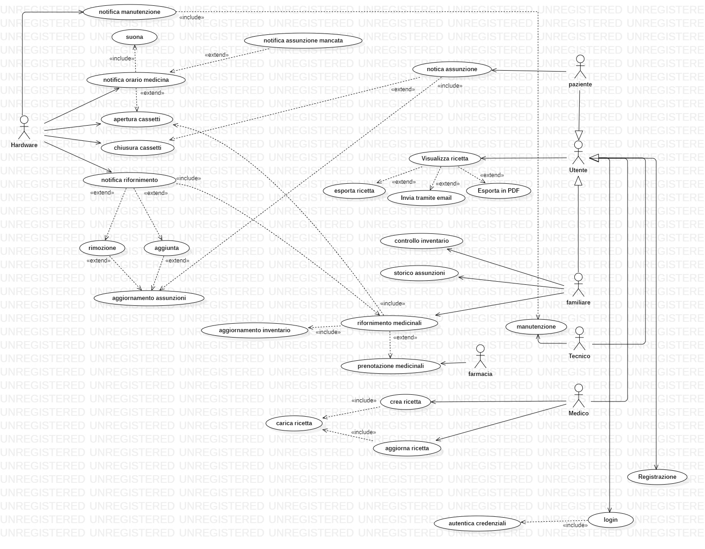
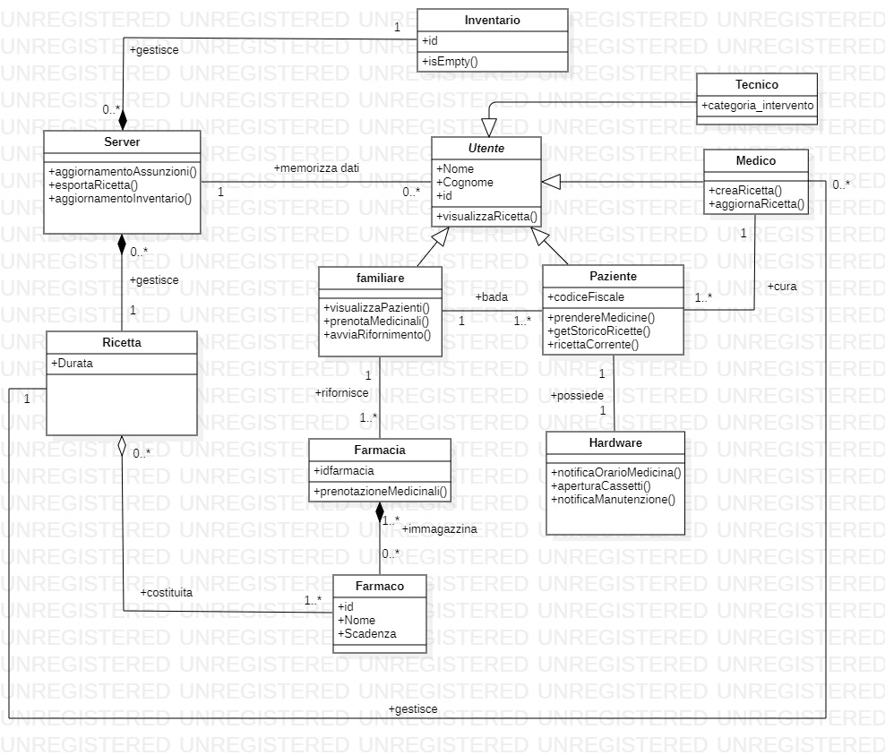
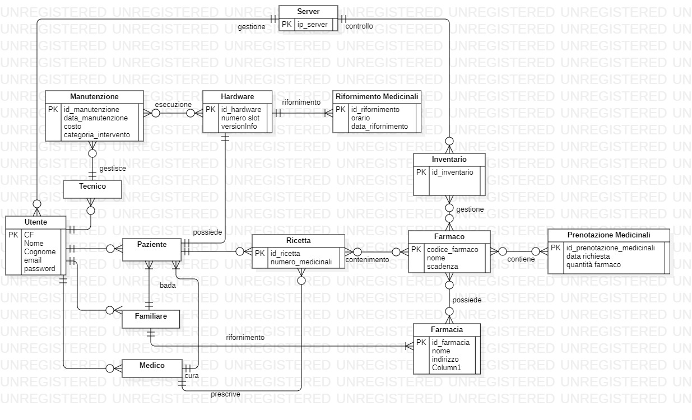

# Progetto ingegneria del software - pilly

## **Requisiti Informali**

Il sistema consiste in un applicazione che ha l'obiettivo di monitorare e aiutare pazienti anziani che hanno bisogno di assumere quantità precise e in maniera regolare di farmaci.
Il sistema dovrà notificare al paziente quando assumere i medicinali in base alla ricetta caricata sul server da parte del medico curante.
La notifica avviene tramite un sistema hardware composto da led, display e vani contenenti medicinali che si apriranno automaticamente, o manualmente dal paziente oppure da un qualsiasi utente, tramite applicazione.
L'applicazione interagisce con un server che hai il compito di memorizzare la quantità e la frequenza riguardo le assunzioni dei medicinali.
Il sistema può interagire con una farmacia con lo scopo di prenotare i medicinali per il rifornimento.

Nello specifico, il sistema verrà usato da 4 tipologie di utenti. Ad ognuna di queste tipologie di utenti sono associate delle specifiche funzioni:

* Il **Medico**, dovrà essere in grado di accedere al database e di ricercare i pazienti in modo da associare ad essi una specifica ricetta. La ricetta può essere importata attraverso una foto o tramite un form da lui personalizzabile.

* Il **Familiare**, dovrà essere in grado di controllare il dispositivo **Hardware** per un eventuale rifornimento di medicinali, visualizzare lo storico delle assunzione da parte del **Paziente** e controllare il quantitativo di medicinali rimanenti nell'apposito cassetto dell'**Hardware**.

* Il **Paziente**, viene notificato dal sistema **Hardware** ad ogni occorrenza dell'assunzione. Dopo l'assunzione il **Paziente** potrà notificare l'assunzione del medicinale tramite la chiusura del cassetto, attraverso un pulsante incluso nel sistema **Hardware**

* Il **Tecnico**, si occuperà della manutenzione non ordinaria dell'**Hardware**, come il blocco del sistema oppure un guasto. 

## **Specifica dei requisiti funzionali**

<!--* **Medico**
    * crea la ricetta tramite app
    * aggiorna una ricetta esistente
* **Familiare**
    * Viene notificato del rifornimento dei medicinali dal sistema, inoltre una volta notificato può prenotare i medicinali presso una farmacia comunicando tramite l'applicazione la ricetta del paziente che ha bisogno del rifornimento.
* **Paziente**
    * 
* **Farmacia**
    * 
* **Tecnico**
    * 
* **sistema**
    * 
* **Hardware**
    * 
--->

<!-- DOMANDA SU RECOVERY??????? --->

## **Specifica dei requisiti non funzionali**

Elenco dei requisiti non funzionali

* **Usabilità** : L'hardware dovrà essere dotato di dispositivi che rendono chiaro il medicinale da assumere cercando di garantire il minimo sforzo da parte dell'anziano. L'interfaccia utente dovrà essere il più possibile user-friendly per garantire un'esperienza fluida da parte dell'utente.    
* **Recovery** : Nel caso l'Hardware non abbia più accesso alla rete deve continuare a notificare l'anziano utilizzando i registri scaricati dall'ultimo update. 
* **Sicurezza** : Il sistema memorizzando dati sensibili quali le ricette prescritte dal medico piuttosto che le patologie del paziente, o le più comuni password, deve garantire un determinato livello di sicurezza per preservarli.
Quindi i dati di ogni singolo utente non devono essere salvati in chiaro ma dovranno essere cifrati attraverso un Secure Hash Algorithm, in particolare lo SHA-256.
<!--* **Affidabilità**--->

*HTTP Server*: **nginx 1.10.3**  
*DBMS*: **PostgreSQL 10.15**   *Linguaggio lato server*: **PHP 5.6.0**  
*Sistema operativo server*: **GNU/Linux Debian 10.7.0**  
*Sistema operativo lato client*: **Android 7.0 o maggiore** / **iOS 10 o maggiore**  
*Piattaforma hardware*: **Architettura ARM 32bit**

## **Use cases diagram**

## **Scenari**

| Caso d'uso : Prendere medicine |
| :----------------------------- |
| **Attori**: Paziente, Hardware |
| **Precondizioni**  <ol><li>Il caso d'uso inizia quando l'orario è prossimo all'ora dell'assunzione del medicinale</ol>|
| **Sequenza degli eventi** <ol><li>Il paziente clicca il pulsante per aprire il cassetto e prendere la medicina</ol>|
| **Post condizioni** <ol><li> L'assunzione è stata registrata sul sistema</ol>|
| **Sequenza alternativa 1** <ol><li>Il paziente non clicca il pulsante per prendere la medicina</ol>|
| **Post condizioni**  <ol><li>La non assunzione è stata registrata sul sistema</li><li>Il familiare viene notificato della non assunzione</ol>|
| **Sequenza alternativa 2** <ol><li>La medicina non è presente</li><li>Clicca pulsante emergenza</ol>|
| **Post condizioni** <ol><li>La non assunzione è stata registrata sul sistema</li><li>Il familiare viene avvisato con una notifica di urgenza</ol>|

| Caso d'uso : Rifornimento medicinali |
| :----------- |
| **Attori**: Farmacia, Familiare, Hardware |
| **Precondizioni**  <ol><li>Notifica di manutenzione da parte dell'app</ol>|
| **Sequenza degli eventi** <ol><li>Il familiare apre il cassetto tramite app</li><li>Conferma il rifornimento dei medicinali tramite app</ol>|
| **Post condizioni** <ol><li> Aggiornamento inventario da parte del sistema</ol>|
| **Sequenza alternativa 1** <ol><li>Prenotazione medicinali</li><li>Il familiare apre il cassetto tramite app</li><li>Conferma il rifornimento dei medicinali tramite app</ol>|
| **Post condizioni**  <ol><li>Aggiornamento inventario da parte del sistema</ol>|

| Caso d'uso : Aggiunta di una ricetta medica | 
| :----------- |
|**Attori**: Medico, Familiare |
|**Precondizioni** <ol><li>Login nell'applicazione da parte del medico</ol> |
|**Sequenza degli eventi** <ol><li>Il dottore crea la ricetta</li><li>Il sistema carica la ricetta</li><li>Il sistema fa un controllo sull'inventario</li><li>Se necessario il sistema aggiorna l'inventario</li></ol>|
|**Post condizioni** <ol><li>Al familiare del paziente viene notificato il caricamento della ricetta</li><li>Il familiare decide se esportare la ricetta in pdf o mandarla via mail alla farmacia</li><li>Si passa al caso d'uso in cui viene effettuata la prenotazione dei medicinali</li></ol>|
|**Sequenza alternativa 1** <ol><li>Il dottore crea la ricetta</li><li>Il sistema carica la ricetta</li><li>Il sistema fa un controllo sull'inventario</li><li>Se necessario il sistema aggiorna l'inventario</li><li>il familiare non vede la notifica della ricetta</li></ol>|
|**Post condizioni** <ol><li>Al familiare viene ripetuta la notifica ogni 5 minuti finché non la visulizza</li><li>Il familiare decide se esportare la ricetta in pdf o mandarla via mail alla farmacia</li><li>Si passa al caso d'uso in cui viene effettuata la prenotazione dei medicinali</li></ol>|

## **Test di livello zero**

## **Diagramma delle classi**

 <!---
 Manca cio che ha detto il committente
 scarno di informazioni
 dettagliare meglio

 ricetta/farmaco come classe e attributi

 iniziare a fare sequenza 
-->

## **Sequence diagrams**

### *Rifornimento medicinali*

### *Crea ricetta*

## **ER Diagram**

## **Component Diagram**

## **Test di livello zero**

## **Diagramma delle classi di secondo livello**